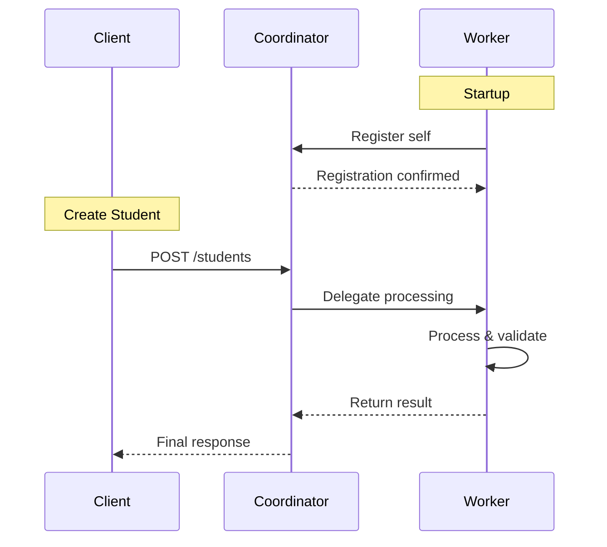

# System Architecture

## Overview

The Distributed University Management System follows a **microservices architecture** with clear separation of concerns between the coordinator and worker nodes.

## Components

### 1. Coordinator Service (Computer 1)

**Responsibilities:**
- Database management (SQLite with SQLAlchemy)
- University and course CRUD operations  
- Student coordination and routing
- Worker registration and discovery
- Load balancing decisions
- System monitoring and statistics

**Key Features:**
- RESTful API endpoints
- Automatic database initialization
- Worker health monitoring
- Graceful degradation when workers unavailable

### 2. Worker Service (Computer 2)

**Responsibilities:**
- Student data processing and validation
- Analytics generation
- Data enrichment operations
- Performance monitoring
- Self-registration with coordinator

**Key Features:**
- Background task processing
- Automatic coordinator registration
- Health check endpoints
- Processing statistics

## Communication Flow

## Data Flow

1. **Universities & Courses**: Stored and managed entirely by coordinator
2. **Students**: Created through coordinator but processed by worker
3. **Analytics**: Generated by worker with real-time data
4. **Statistics**: Aggregated from both coordinator and worker

## Scalability Design

- **Horizontal Scaling**: Multiple workers can register with one coordinator
- **Load Distribution**: Round-robin or capability-based assignment
- **Fault Tolerance**: Coordinator handles worker failures gracefully
- **Service Discovery**: Workers register automatically on startup

## Security Considerations

- **Network Isolation**: Services run on separate ports
- **Input Validation**: Pydantic models ensure data integrity
- **Error Handling**: Comprehensive exception management
- **Health Monitoring**: Regular health checks prevent cascading failures

## Technology Stack

### Backend
- **FastAPI**: Modern Python web framework
- **SQLAlchemy**: Database ORM
- **SQLite**: Lightweight database
- **Pydantic**: Data validation
- **HTTPX**: Async HTTP client

### Infrastructure
- **Uvicorn**: ASGI server
- **Python 3.8+**: Runtime environment
- **Virtual Environment**: Dependency isolation
